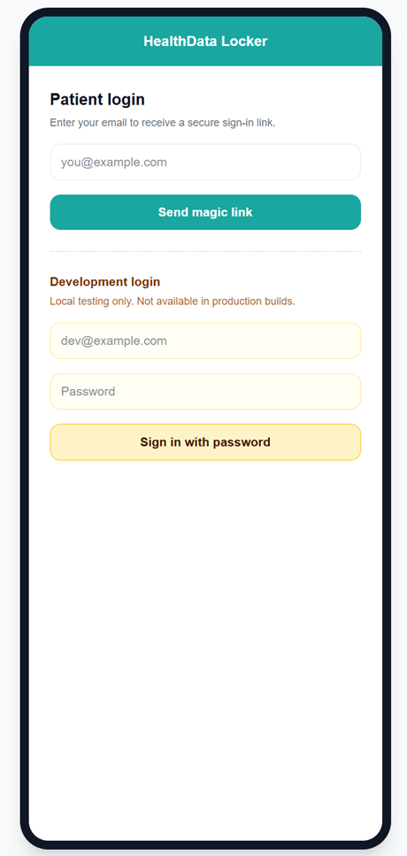

# HealthData Locker

HealthData Locker is a mobile-first web application that allows patients to securely access prescriptions and manage uploaded health documents.

This repository is the public coursework version of the project. It demonstrates database integration, authentication, authorization, validated file uploads, responsive design, protected routes, session handling, and secure storage.

All names, prescriptions, diagnoses, documents, and screenshots used in this repository are fictional or synthetic demonstration data.

## Project Overview

Medical records in Bangladesh are often distributed across paper prescriptions, diagnostic centers, pharmacies, clinics, and personal devices. HealthData Locker provides patients with one place to access their prescriptions and save supporting medical documents.

The current version focuses on the patient-facing workflow. A patient can sign in, view prescriptions associated with their account, open prescription details, upload medical reports, and delete previously uploaded reports.

Doctor and clinic workflows are planned for a future phase and are not part of the current MVP.

## Current Features

* Secure patient login using Supabase Authentication
* Magic-link authentication by email
* Development-only password login for local testing
* Protected patient routes
* Secure session handling through cookies
* Patient-specific dashboard
* Prescription list and prescription detail pages
* Public prescription links using secure random tokens
* Uploading PDF and image files
* File type and file size validation
* Listing uploaded reports
* Deleting uploaded reports
* Private file storage using Supabase Storage
* PostgreSQL Row Level Security policies
* Responsive, mobile-first interface
* Logout functionality

## Application Routes

| Route                    | Purpose                                                                       |
| ------------------------ | ----------------------------------------------------------------------------- |
| `/login`                 | Patient login                                                                 |
| `/patient/dashboard`     | Patient prescriptions and recent uploaded reports                             |
| `/patient/uploads`       | Upload, view, and delete medical documents                                    |
| `/p/[token]`             | View a prescription using its public token                                    |
| `/patient/account-setup` | Message shown when an authenticated account is not linked to a patient record |
| `/auth/callback`         | Processes authentication callbacks from Supabase                              |

## Technology Stack

* Next.js App Router
* TypeScript
* JavaScript ES6+
* React
* Tailwind CSS
* Supabase PostgreSQL
* Supabase Authentication
* Supabase Storage
* PostgreSQL Row Level Security
* Server-side rendering
* Server Actions
* Secure cookie-based sessions
* ESLint
* Git and GitHub

## Architecture

The application uses Next.js for both the user interface and server-side application logic.

Supabase provides:

* PostgreSQL database hosting
* User authentication
* Session management
* Private file storage
* Row Level Security
* Database functions and triggers

The application does not trust a patient ID supplied by the browser. Server-side code identifies the authenticated user through Supabase and resolves the patient record associated with that user.

## Database Tables

| Table              | Purpose                                                                           |
| ------------------ | --------------------------------------------------------------------------------- |
| `profiles`         | Stores application profile information connected to authenticated users           |
| `patients`         | Stores patient information and links a patient record to an authenticated account |
| `prescriptions`    | Stores prescriptions associated with patients                                     |
| `uploaded_reports` | Stores metadata for patient-uploaded documents                                    |

Uploaded files are stored in the private `patient-reports` Supabase Storage bucket.

The expected storage path format is:

```text
{patient_id}/{generated-file-name}
```

## Authentication Flow

1. The patient enters an email address on the login page.
2. Supabase sends a secure magic link.
3. The patient opens the link.
4. Supabase redirects the browser to `/auth/callback`.
5. The callback exchanges the authorization code for a session.
6. The session is stored using secure cookies.
7. Protected patient routes verify the authenticated user.
8. The application finds the patient record linked to that user.
9. The patient is redirected to the dashboard.

For convenient local development, the project may also display a development-only password login form. It is not intended to appear in production builds.

## Authorization and Data Security

Authorization is enforced through protected routes, server-side user verification, and PostgreSQL Row Level Security.

The security rules are designed so that:

* Patients can access only their own patient record.
* Patients can view only their own prescriptions while authenticated.
* Patients can view, upload, and delete only their own report records.
* Uploaded files are stored in patient-specific paths.
* Anonymous users cannot browse patient dashboards or uploaded reports.
* A public prescription token returns only the limited information needed for that prescription.
* Public prescription access does not expose the patient’s phone number, date of birth, uploaded reports, or other prescriptions.

## Public Prescription Links

Each prescription can have a randomly generated public token.

A URL in the following format can be used to display one prescription:

```text
/p/[token]
```

For anonymous visitors, the application uses a restricted database function to return only the fields required for the public prescription page.

Authenticated patients must own the prescription to access it through the normal authenticated workflow.

## File Upload Validation

The report upload workflow validates files before saving them.

Supported file categories include:

* PDF documents
* Supported image formats

The application rejects:

* Unsupported file types
* Files exceeding the configured size limit
* Upload requests from users who are not authenticated
* Upload requests from accounts that are not linked to a patient record

## Course Requirements Mapping

| Course objective or requirement | Project implementation                                                                |
| ------------------------------- | ------------------------------------------------------------------------------------- |
| Database integration            | Supabase-hosted PostgreSQL database                                                   |
| Login with authentication       | Supabase email magic-link authentication and development-only password login          |
| Authorization                   | Protected routes, server-side ownership checks, and PostgreSQL Row Level Security     |
| User form to post data          | Patient medical-report upload form                                                    |
| Input validation                | File type and file size validation                                                    |
| Responsive or mobile target     | Mobile-first responsive interface                                                     |
| JavaScript ES6                  | Next.js and TypeScript compile to modern JavaScript                                   |
| Server-side application         | Next.js server components, route handlers, middleware/proxy logic, and server actions |
| Session and cookies             | Supabase authentication sessions stored using cookies                                 |
| SSL                             | Supported through HTTPS deployment                                                    |
| Database schema relationships   | PostgreSQL foreign keys between users, profiles, patients, prescriptions, and reports |
| Secure file storage             | Private Supabase Storage bucket with access policies                                  |
| Unit testing                    | Validation logic can be tested independently through the configured test framework    |
| GitHub                          | Source code is maintained in this public GitHub repository                            |

## Technology Selection Note

The original course outline references Express, MongoDB, Mongoose, Vue, Bootstrap, jQuery, and related technologies.

This project uses Next.js and Supabase PostgreSQL instead. This was a deliberate architectural decision to build the application using a modern full-stack framework and a relational database.

PostgreSQL is appropriate for this project because prescriptions, patients, authenticated users, uploaded reports, and provider profiles have clear relationships that benefit from:

* Foreign-key constraints
* Relational queries
* Database functions
* Database triggers
* Transactional consistency
* Row Level Security

Next.js provides both front-end and back-end functionality within one application, including server-rendered pages, protected routes, server actions, and API-style route handlers.

The selected stack fulfills the main functional objectives of the course project even though some implementation technologies differ from the suggested stack.

## Local Setup

### 1. Clone the repository

```bash
git clone <PUBLIC_REPOSITORY_URL>
cd healthdata-locker-coursework/app
```

Replace `<PUBLIC_REPOSITORY_URL>` with the URL of this repository.

### 2. Install dependencies

```bash
npm install
```

### 3. Create the environment file

Copy the example environment file:

```bash
cp .env.example .env.local
```

On Windows, the file can also be copied manually.

Enter the required Supabase project values in `.env.local`:

```env
NEXT_PUBLIC_SUPABASE_URL=your-supabase-project-url
NEXT_PUBLIC_SUPABASE_ANON_KEY=your-supabase-anon-key
NEXT_PUBLIC_SITE_URL=http://localhost:3000
```

Do not commit `.env.local`.

### 4. Configure Supabase

Review and run:

```text
supabase/patient-mvp-setup.sql
```

The setup includes:

* Patient-to-authenticated-user linkage
* Profiles table setup
* Profile creation trigger
* Row Level Security
* Patient data access policies
* Prescription access policies
* Uploaded-report access policies
* Storage access policies
* Public prescription database function

A private Supabase Storage bucket named `patient-reports` is required.

### 5. Configure the authentication callback

In Supabase, open:

```text
Authentication → URL Configuration
```

Set the local Site URL to:

```text
http://localhost:3000
```

Add this redirect URL:

```text
http://localhost:3000/auth/callback
```

### 6. Link a test authenticated user to a patient

After creating a test authentication user, obtain:

* The authenticated user UUID
* The patient row UUID

Then run:

```sql
UPDATE public.patients
SET user_id = 'AUTH_USER_UUID'
WHERE id = 'PATIENT_ROW_UUID';
```

Replace both placeholder UUID values with actual test values.

### 7. Start the application

```bash
npm run dev
```

Open:

```text
http://localhost:3000
```

## Available Scripts

```bash
npm run dev
```

Starts the development server.

```bash
npm run lint
```

Runs ESLint.

```bash
npm run build
```

Creates an optimized production build.

If automated tests are configured:

```bash
npm run test
```

or:

```bash
npm run test:run
```

## Manual Testing Checklist

Before demonstrating the application, verify the following:

* [ ] The login page loads.
* [ ] A valid user can sign in.
* [ ] An unauthenticated visitor is redirected away from protected patient routes.
* [ ] Login creates a working session.
* [ ] The patient dashboard displays only the linked patient’s prescriptions.
* [ ] The patient dashboard displays only the linked patient’s uploaded reports.
* [ ] A PDF file can be uploaded.
* [ ] A supported image can be uploaded.
* [ ] An unsupported file type is rejected.
* [ ] An oversized file is rejected.
* [ ] An uploaded report appears in the dashboard or upload list.
* [ ] An uploaded report can be deleted.
* [ ] The database record is removed after deletion.
* [ ] The corresponding Storage object is removed after deletion.
* [ ] A valid public prescription token displays one prescription.
* [ ] An invalid token returns a not-found result.
* [ ] One patient cannot access another patient’s private data.
* [ ] Logout clears the session.
* [ ] `npm run lint` passes.
* [ ] `npm run build` passes.

## Screenshots

### Patient Login

Add the login-page screenshot here:

```markdown

```

### Patient Dashboard

Add the dashboard screenshot here:

```markdown

```

### Prescription Detail

Add the prescription-detail screenshot here:

```markdown

```

### Uploaded Reports

Add the upload-management screenshot here:

```markdown

```

Create the following folder if it does not already exist:

```text
docs/screenshots/
```

## Current MVP Limitations

* The current MVP is patient-facing only.
* Doctor and clinic routes are placeholders.
* Patient accounts must currently be linked to patient records manually.
* Magic-link email delivery depends on Supabase email limits and configuration.
* Production deployment configuration is not included in this repository.
* Public prescription links do not currently include rate limiting.
* A failed database insert after a successful file upload could leave an orphaned Storage object.
* The dashboard displays only a limited number of recent reports.
* Offline medical-record caching is not enabled.

## PWA Decision

Generic offline caching was intentionally not added to the current health-data MVP.

Medical records are sensitive. A production PWA implementation would require a deliberate design for:

* Offline authorization
* Device-level security
* Cache expiration
* Logout cleanup
* Encryption
* Shared-device behavior
* Protection of downloaded medical records

Adding a generic service worker solely to cache authenticated pages could create privacy and stale-data risks. PWA support is therefore treated as a future security-sensitive enhancement rather than a basic caching feature.

## Future Development

Possible future improvements include:

* Doctor authentication and dashboard
* Doctor-created prescriptions
* Clinic onboarding
* Patient self-registration and identity verification
* QR-code generation and scanning
* Account-to-patient linking workflow
* Automated end-to-end tests
* File malware scanning
* Audit logs
* Rate limiting
* Improved error recovery for uploads
* Notification support
* Secure deployment
* Carefully designed offline support

## Privacy Notice

This repository must not contain:

* Real patient records
* Real diagnoses
* Real prescriptions
* Real medical documents
* Private email addresses
* Production credentials
* Supabase service-role keys
* `.env.local`
* Private planning documents

All committed sample data and screenshots should be clearly fictional or synthetic.

## Academic Project Notice

This repository was prepared as a software engineering course project. It is an educational MVP and is not approved for real clinical use.

It should not be used to store, transmit, diagnose, or manage real patient medical information without additional security review, legal review, privacy controls, deployment hardening, and regulatory compliance work.

## Author

Md Rakeen Murtaza
